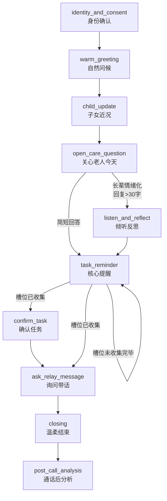

# 通话链路 Agent 架构全景

> **"突然有点惦记你们" — AI 亲情关怀电话系统**
> 版本：v2 (2026-06-14)

---

## 一、架构总览

```
┌─────────────────────────────────────────────────────────────────┐
│                         API 层 (Next.js Routes)                   │
│                                                                   │
│  /api/calls/start          — 发起通话                              │
│  /api/calls/[sessionId]/turn   — 通话轮次（循环）                   │
│  /api/calls/[sessionId]/finalize — 通话后分析（幂等）               │
│  /api/elder-call-conversation  — 长辈端状态机驱动通话               │
└─────────────────────────────────────────────────────────────────┘
                                    │
                                    │ Feature Flag: AGENT_V2_CALL
                                    │ [v2 workflow → fallback to v1]
                                    │
        ┌───────────────────────────┴─────────────────────────────┐
        │                                                             │
        ▼                                                             ▼
┌───────────────────────┐                              ┌──────────────────────────────┐
│   v2 Call Workflow    │                              │   v1 Call Orchestrator       │
│   (workflows/)        │                              │   (services/)                │
│                       │                              │                              │
│  • call.workflow.ts   │                              │  • call-orchestrator.ts     │
│  • startCall()        │                              │  • startCall()              │
│  • processTurn()      │                              │  • processTurn()            │
│  • response-adapter   │                              │  • finalizeCall()           │
└───────────┬───────────┘                              └──────────────┬───────────────┘
            │                                                        │
            │ [v2 Cognitive Skills]                                 │ [v1 Agents]
            │                                                        │
            ▼                                                        ▼
┌─────────────────────────────────────┐                ┌─────────────────────────────┐
│  Cognitive Skills (4 个)            │                │  v1 Agents (3 个)           │
│  (cognitive/)                       │                │  (agents/)                   │
│                                     │                │                             │
│  1. call-plan-builder.ts            │                │  1. call-plan-generator.ts   │
│     → 生成通话计划                  │                │  2. relational-conversation │
│                                     │                │  3. turn-planner.ts          │
│  2. call-turn-engine.ts             │                │                             │
│     → 每轮对话生成                  │                │  [已标记 @deprecated]       │
│                                     │                │                             │
│  3. post-call-extractor.ts          │                │                             │
│     → 通话后结构化提取              │                │                             │
│                                     │                │                             │
│  4. memory-insight-writer.ts        │                │                             │
│     → 记忆 + 洞察生成               │                │                             │
└─────────────────────────────────────┘                └─────────────────────────────┘
            │                                                        │
            └────────────────┬───────────────────────────────────────┘
                             │
                             ▼
┌─────────────────────────────────────────────────────────────────┐
│                      LLM Provider                                 │
│  services/llm.service.ts — 统一 DeepSeek 调用                    │
└─────────────────────────────────────────────────────────────────┘
                             │
                             ▼
┌─────────────────────────────────────────────────────────────────┐
│                Domain Services + Safety + EventBus               │
│                                                                     │
│  Services:                                                        │
│  • context.service.ts — 上下文组装                               │
│  • safety.service.ts — 三层安全设计                              │
│  • event-bus.service.ts — 事件总线                               │
│  • call-session.service.ts — 通话会话管理                        │
│  • call-orchestrator.ts — v1 编排器（兼容 fallback）              │
│  • conversation-state-machine.ts — 状态机                       │
│  • scheduler-service.ts — 定时调度                               │
└─────────────────────────────────────────────────────────────────┘
                             │
                             ▼
┌─────────────────────────────────────────────────────────────────┐
│                    Store 层 (Memory Store)                        │
│                                                                     │
│  核心实体:                                                        │
│  • Elder — 长辈档案                                               │
│  • Caregiver — 子女档案                                           │
│  • TaskTemplate — 任务模板                                        │
│  • TaskOccurrence — 任务实例                                      │
│  • CallSession — 通话会话                                         │
│  • ConversationState — 通话状态                                   │
│  • Memory — 长期记忆（6类）                                       │
│  • CareInsight — 亲情洞察                                         │
│  • RelayMessage — 传话                                            │
└─────────────────────────────────────────────────────────────────┘
```

---

## 二、通话状态机（确定性控制）

### 状态流转图



### 状态定义与触发条件

| 状态 | 触发条件 | 目标 |
|------|---------|------|
| `identity_and_consent` | 通话接通 | 说明"我是XX设置的念念"，不冒充 |
| `warm_greeting` | 身份确认完成 | 自然寒暄，建立信任 |
| `child_update` | 寒暄结束 | 转达子女近况（如适用） |
| `open_care_question` | 日常关心完成 | 询问长辈今天状态（6 类话题轮换） |
| `listen_and_reflect` | 长辈情绪化回复 | 倾听 + 情绪回应，不下判断 |
| `task_reminder` | 日常关心完成 | 完成核心提醒任务 |
| `confirm_task` | 槽位收集完毕 | 确认长辈理解/同意任务 |
| `ask_relay_message` | 任务确认完成 | 询问长辈有没有话带给孩子 |
| `closing` | 带话处理完成 | 温柔结束，祝愿健康 |
| `post_call_analysis` | 通话结束 | 结构化提取 + 记忆写入 + 洞察生成 |

### 硬性结束条件

| 条件 | 阈值 | 处理 |
|------|------|------|
| 长辈明确拒绝 | `elderWillingness=refused` | 立即关闭通话 |
| 超时 | `elapsedSeconds > 240`（4分钟） | 强制结束 |
| 超轮次 | `turnCount > 12` | 强制结束 |

---

## 三、三层安全设计

```
┌─────────────────────────────────────────────────────────────┐
│  输入: 长辈语音转文字 (elderUtterance)                        │
└─────────────────────────────────────────────────────────────┘
                              │
                              ▼
┌─────────────────────────────────────────────────────────────┐
│  Layer 1: preCheck(input)                                    │
│  ┌─────────────────────────────────────────────────────────┐│
│  │  纯规则初筛，关键词匹配安全策略                         ││
│  │                                                          ││
│  │  • medical_no_diagnosis  — 检测"是糖尿病/老年痴呆"      ││
│  │  • medical_no_dosage     — 检测具体用药剂量             ││
│  │  • no_impersonation      — 检测"我是小雨"               ││
│  │  • no_blame_no_guilt     — 检测责备/制造愧疚            ││
│  │  • safety_risk           — 检测"想跳楼/自杀"            ││
│  └─────────────────────────────────────────────────────────┘│
│                                                              │
│  输出: Policy[] (触发的安全策略列表)                          │
└─────────────────────────────────────────────────────────────┘
                              │
                              ▼
┌─────────────────────────────────────────────────────────────┐
│  Layer 2: mergePolicy(preCheck, classifier)                  │
│  ┌─────────────────────────────────────────────────────────┐│
│  │  LLM 分类结果 (IntentSituationClassifier)              ││
│  │  + preCheck 结果 → 取并集（保守原则）                 ││
│  │                                                          ││
│  │  例如: preCheck 检测到"可能诊断" + LLM 分类为医疗话题  ││
│  │       → 合并为医疗诊断策略                              ││
│  └─────────────────────────────────────────────────────────┘│
│                                                              │
│  输出: Policy[] (合并后的安全策略)                            │
└─────────────────────────────────────────────────────────────┘
                              │
                              ▼
┌─────────────────────────────────────────────────────────────┐
│  Layer 3: policyConstraint(policy) → prompt 注入            │
│  ┌─────────────────────────────────────────────────────────┐│
│  │  根据 Policy 生成约束字符串数组，注入到 LLM prompt     ││
│  │                                                          ││
│  │  示例注入:                                               ││
│  │  • "绝不能说'她就是老年痴呆'"                           ││
│  │  • "不能提供具体用药剂量"                               ││
│  │  • "如果长辈说难受，只能说'我帮您记下来'"              ││
│  └─────────────────────────────────────────────────────────┘│
└─────────────────────────────────────────────────────────────┘
                              │
                              ▼
┌─────────────────────────────────────────────────────────────┐
│  LLM 生成回复 (DeepSeek Chat API)                             │
│  • 约束已注入到 prompt 中                                     │
│  • Temperature: 0.7 (温暖但可控)                             │
└─────────────────────────────────────────────────────────────┘
                              │
                              ▼
┌─────────────────────────────────────────────────────────────┐
│  Layer 4: postCheck(output)                                  │
│  ┌─────────────────────────────────────────────────────────┐│
│  │  对 LLM 输出做二次检查                                 ││
│  │                                                          ││
│  │  • ALLOW   — 通过，返回原文                              ││
│  │  • SANITIZE — 自动修复违规内容                          ││
│  │              "我是小雨" → "我是小雨设置的念念"          ││
│  │  • BLOCK   — 拦截，返回安全兜底话术                     ││
│  └─────────────────────────────────────────────────────────┘│
└─────────────────────────────────────────────────────────────┘
                              │
                              ▼
┌─────────────────────────────────────────────────────────────┐
│  输出: assistantReply (安全放行)                              │
└─────────────────────────────────────────────────────────────┘
```

### 安全策略清单

| 策略 ID | 触发条件 | 处理方式 |
|---------|---------|---------|
| `medical_no_diagnosis` | 输出包含"就是XX病/确诊XX" | BLOCK + 兜底 |
| `medical_no_dosage` | 输出包含具体剂量"吃两片" | SANITIZE → "按医嘱服用" |
| `no_impersonation` | 输出"我是小雨" | SANITIZE → "我是小雨设置的念念" |
| `no_blame_no_guilt` | 输出"你怎么又忘了" | SANITIZE → "提醒您一下" |
| `cognitive_careful` | 认知话题 + 判断性词汇 | 注入谨慎约束 |
| `safety_risk` | 检测自杀/伤害意图 | BLOCK + 紧急提示 |
| `no_sensitive_extraction` | 尝试提取存折/密码 | BLOCK |

---

## 四、v2 Cognitive Skills（通话链路核心）

### 4.1 Call Plan Builder（通话计划生成）

**文件**: `src/lib/cognitive/call-plan-builder.ts`  
**Prompt**: `src/lib/prompts/call-plan-builder.prompt.ts`  
**Schema**: `src/lib/schemas/call.schema.ts`

#### 职责
生成分阶段通话计划，包含每个阶段的目标、示例话术、追问预算。

#### 输入
```json
{
  "elder": { "displayName": "妈妈", "relation": "mother", "communicationStyle": "warm" },
  "caregiver": { "displayName": "小雨", "nickname": "小雨" },
  "task": {
    "title": "提醒妈妈吃药",
    "taskType": "daily_care_call",
    "primaryObjectives": [{ "type": "reminder", "content": "提醒吃药" }],
    "relationshipObjectives": [{ "type": "express_care", "content": "关心妈妈身体" }]
  },
  "recentCallSummaries": ["上次通话妈妈说有点头晕", "3天前通话提醒了吃药"],
  "relationshipMemory": ["妈妈喜欢聊做菜", "提到过想去公园"],
  "careTopicRotationIndex": 2
}
```

#### 输出
```json
{
  "callPlanId": "call_20260614_001",
  "maxDurationSeconds": 180,
  "maxExtraQuestions": 2,
  "stages": [
    {
      "stage": "identity_and_consent",
      "goal": "说明身份并自然开场",
      "sampleScript": "阿姨您好呀~我是小雨设置的小助理念念，TA今天惦记您啦~"
    },
    {
      "stage": "warm_greeting",
      "goal": "自然问候，建立信任",
      "sampleScript": "今天天气还不错呢~"
    },
    {
      "stage": "open_care_question",
      "goal": "关心长辈今天的状态（话题轮换）",
      "sampleScript": "今天吃得怎么样呀？"
    }
  ],
  "probeBudget": {
    "totalRemaining": 3,
    "healthRemaining": 1,
    "relationshipRemaining": 2
  },
  "avoidTopics": ["不要提爸爸的事", "不说您最近瘦了"]
}
```

---

### 4.2 Call Turn Engine（轮次对话引擎）

**文件**: `src/lib/cognitive/call-turn-engine.ts`  
**Prompt**: `src/lib/prompts/call-turn-engine.prompt.ts`  
**Schema**: `src/lib/schemas/call.schema.ts`

#### 职责
通话链路**每一轮的核心引擎**，在一次 LLM 调用中同时完成：
1. 分析长辈输入（事实提取、槽位、情绪、风险）
2. 生成助手回复
3. 决定下一阶段
4. 更新状态 patch
5. 生成观察记录

#### 人设
> "你是念念，一个温柔、有分寸的亲情关怀助理。你正在和长辈通电话。"
> - 语气像活泼温暖的小妹妹/晚辈
> - 多用语气词：呀、呢、嘛、啦、哦、~
> - 先寒暄，再提醒
> - 不责备长辈，不制造焦虑

#### 输入
```json
{
  "elderUtterance": "吃了吃了，今天早饭后就吃了",
  "currentStage": "task_reminder",
  "currentStageGoal": "核心提醒",
  "transcript": [
    { "speaker": "assistant", "content": "阿姨您好呀~我是小雨设置的小助理念念，TA今天惦记您啦~", "stage": "identity_and_consent" },
    { "speaker": "elder", "content": "哎，你是谁呀？", "stage": "identity_and_consent" },
    ...
  ],
  "taskSlotsCollected": { "medication_taken": false },
  "probeBudget": { "totalRemaining": 3, "healthRemaining": 1, "relationshipRemaining": 2 },
  "elderWillingness": "willing",
  "shouldCloseSoon": false,
  "turnCount": 4,
  "elapsedSeconds": 45,
  "relationshipMemory": ["妈妈习惯早饭后吃药", "喜欢聊做菜"],
  "sensitiveTopics": ["不要提爸爸的事"],
  "avoidTopics": ["不说您最近瘦了"]
}
```

#### 输出（五部分）
```json
{
  "analysis": {
    "factualInfo": { "medication_taken": true, "time": "早饭后" },
    "taskSlots": { "medication_taken": true },
    "emotion": { "label": "neutral", "confidence": 0.8 },
    "riskSignals": [],
    "probeOpportunities": [
      { "type": "health", "questionGoal": "确认食欲", "priority": "normal" }
    ],
    "stageCompleted": true
  },
  "assistantReply": "好的呀，记下来啦~",
  "nextStage": "ask_relay_message",
  "nextStageReason": "任务槽位已收集完毕，进入询问带话",
  "statePatch": {
    "taskSlots": { "medication_taken": true },
    "probeBudget": { "totalRemaining": 2 }
  },
  "observations": [
    { "type": "routine_memory", "content": "妈妈习惯早饭后吃药", "confidence": 0.9 }
  ],
  "isCallEnding": false
}
```

#### 确定性约束（状态机覆盖）
| 约束 | 说明 | 来源 |
|------|------|------|
| probeBudget | 追问次数不超过预算 | 状态机验证 |
| shouldCloseSoon | LLM 返回 true 时，状态机限制额外提问 | 软信号 |
| stageCompleted | true 时，状态机推进到 nextStage | 硬规则 |
| isCallEnding | true 时，强制结束通话 | 硬规则 |

---

### 4.3 Post-Call Extractor（通话后提取）

**文件**: `src/lib/cognitive/post-call-extractor.ts`  
**Prompt**: `src/lib/prompts/post-call-extractor.prompt.ts`  
**Schema**: `src/lib/schemas/post-call.schema.ts`

#### 职责
从完整通话记录中提取结构化结果：任务完成状态、槽位、风险信号、长辈传话。

#### 输入
```json
{
  "transcript": [完整对话记录],
  "task": { "title": "提醒妈妈吃药", "taskType": "daily_care_call" },
  "requiredSlots": ["medication_taken", "general_condition"],
  "elder": { "displayName": "妈妈" }
}
```

#### 输出
```json
{
  "taskStatus": "completed",
  "slots": {
    "medication_taken": true,
    "general_condition": "还好，精神不错"
  },
  "riskSignals": [
    {
      "type": "symptom",
      "content": "提到头晕",
      "severity": "medium",
      "shouldNotifyCaregiver": true
    }
  ],
  "messageToChild": "跟小雨说我没事，让她别担心",
  "confidence": 0.85,
  "needsReview": false
}
```

---

### 4.4 Memory Insight Writer（记忆与洞察生成）

**文件**: `src/lib/cognitive/memory-insight-writer.ts`  
**Prompt**: `src/lib/prompts/memory-insight-writer.prompt.ts`  
**Schema**: `src/lib/schemas/memory.schema.ts`, `src/lib/schemas/care-insight.schema.ts`

#### 职责
生成两类输出：
1. **长期记忆**（写入 Memory Store）— 6 类
2. **亲情洞察**（返回给子女）— 四维结构

#### 记忆类型
| 类型 | 说明 | 示例 |
|------|------|------|
| `health_memory` | 健康数据 | "血压 130/85"、"血糖 6.5" |
| `routine_memory` | 生活习惯 | "习惯早饭后吃药" |
| `preference_memory` | 沟通偏好 | "喜欢被叫'阿姨'" |
| `relationship_memory` | 关系模式 | "每次提到小雨都会笑" |
| `relay_memory` | 对家属的牵挂 | "让小雨多吃水果" |
| `emotional_signal` | 情绪信号 | "说到过年时声音哽咽" |

#### 洞察输出
```json
{
  "factualSummary": "妈妈今天早饭后吃了药，血压130/85，精神不错",
  "relationshipInsight": "妈妈听说你最近加班，第一反应是让你好好吃饭。她嘴上说不用你操心，但其实挺惦记你。",
  "suggestedAction": "如果有时间，可以晚上给妈妈回个电话，聊聊做菜的事她会开心",
  "suggestedMessage": "妈，今天听念念说你精神不错，我就放心啦~注意身体呀",
  "confidence": 0.85
}
```

---

## 五、v2 Workflow 编排层

### 5.1 Call Workflow（通话工作流）

**文件**: `src/lib/workflows/call.workflow.ts`

#### 三个核心函数

**`startCall()`** — 通话启动
```typescript
1. 加载 TaskOccurrence + TaskTemplate + Elder
2. 创建 CallSession（状态机初始化为 identity_and_consent）
3. 调用 callPlanBuilder 生成通话计划
4. 生成开场白
5. Safety Guard 检查开场白
6. 持久化 CallSession
7. 返回 { sessionId, initial_reply, stage, meta: { v2: true } }
```

**`processTurn()`** — 逐轮对话（核心循环）
```typescript
1. 加载 CallSession + CallPlan + FamilyContext
2. 长辈输入追加到 transcript
3. 调用 Call Turn Engine
   ├─ analysis: 提取事实/槽位/情绪
   ├─ assistantReply: 生成回复
   ├─ nextStage: 决定下一阶段
   ├─ statePatch: 更新状态
   └─ observations: 生成观察记录
4. Safety Guard 三层安全检查
5. 确定性约束（probe budget / shouldCloseSoon）
6. 状态机推进到 nextStage
7. 助手回复追加到 transcript
8. 持久化 CallSession
9. 返回 { assistant_reply, is_call_ending, observations, meta: { v2: true } }
```

**`finalizeCall()`** — 通话后分析（幂等）
```typescript
1. 幂等检查（若 postCallStatus=completed，直接返回）
2. 更新 postCallStatus=processing
3. 调用 Post-Call Extractor
   ├─ taskStatus: completed/confirmed/unconfirmed/timeout
   ├─ slots: 收集的槽位
   ├─ riskSignals: 风险信号
   └─ messageToChild: 长辈传话
4. 调用 Memory Insight Writer
   ├─ memories: 6 类长期记忆
   └─ insight: 四维亲情洞察
5. 保存 CareInsight
6. 若有长辈传话 → 创建 RelayMessage
7. 更新 TaskOccurrence 状态
8. 推进 TaskTemplate 下次执行时间
9. 更新 postCallStatus=completed
10. 返回 { summary, memories_extracted, care_insight_id, meta: { v2: true } }
```

---

### 5.2 Response Adapter（v2 → 旧前端适配）

**文件**: `src/lib/workflows/response-adapter.ts`

#### 职责
将 v2 WorkflowResult 适配为旧前端 AgentResponse 格式，保证前端不因数据结构变化崩溃。

#### 适配函数
| v2 Kind | 前端格式 | 适配器 |
|---------|---------|--------|
| `call_turn` | `{ assistant_reply, is_call_ending, observations, ... }` | `adaptCallTurn()` |
| `post_call` | `{ summary, memories_extracted, care_insight_id, ... }` | `adaptPostCall()` |
| `error` | `{ kind: "text", content: "哎呀，我刚才走神了一下~", meta: { v2_fallback: true } }` | `buildFallbackResponse()` |

---

### 5.3 Feature Flag（灰度控制）

**文件**: `src/lib/workflows/feature-flag.ts`

#### 优先级规则
```
AGENT_ARCH_VERSION=v2 (全局)
  ↓
AGENT_V2_CALL=true (链路级)
  ↓
默认 v1 (fallback)
```

#### v2 → v1 自动回退
```typescript
try {
  if (isV2Enabled("call")) {
    return await callWorkflowProcessTurn({ ... });
  }
} catch (v2Error) {
  if (shouldFallbackToV1(v2Error, "call")) {
    // fall through 到 v1 实现
  } else {
    throw v2Error; // 不允许回退的错误直接抛出
  }
}
```

---

## 六、关键收尾（记忆确认）

### 通话状态机最终落地 4 项关键收尾

| # | 修复项 | 说明 |
|---|--------|------|
| 1 | measurement_value 正则修正 | `/(血糖\|血压\|心率\|体温).{0,6}?(\d+\.?\d*(\/\d+)?)/` — 精准匹配指标词+数值结构 |
| 2 | confirmed stage 约束 | 仅在 `task_reminder/task_followup` 阶段才视为任务完成，避免寒暄阶段误判 |
| 3 | health_abnormal 否定排除 | 增加 `/不痛\|没痛\|不疼\|没事\|没有不舒服/`，防止误触发 |
| 4 | 表驱动测试全覆盖 | 称谓转换、意图分类、状态推进全部采用表驱动测试，覆盖 ASR 口语变体、复合句、单字昵称等边界场景 |

---

## 七、v1 通话 Agent（兼容层）

| Agent | 文件 | 状态 |
|-------|------|------|
| Call Plan Generator | `agents/call-plan-generator.ts` | @deprecated → `cognitive/call-plan-builder.ts` |
| Relational Conversation | `agents/relational-conversation.ts` | @deprecated → Turn Planner 接管 |
| Turn Planner | `agents/turn-planner.ts` | @deprecated → `cognitive/call-turn-engine.ts` |

**注意**: v1 Agents 仍保留用于 fallback，但标记为 `@deprecated`。

---

## 八、完整通话流程图（v2）

```
[定时调度 / 手动触发]
        │
        ▼
┌─────────────────────────────┐
│ /api/calls/start            │
│ Feature Flag: isV2Enabled() │
└────────────┬────────────────┘
             │
             ├─ v2: callWorkflow.startCall()
             │   ├─ callPlanBuilder.generate()
             │   ├─ 安全检查
             │   └─ 返回 { sessionId, initial_reply, stage }
             │
             └─ v1 (fallback): callOrchestrator.startCall()
                 └─ [旧流程，略]
             │
        [接通电话，进入循环]
             │
             ▼
┌─────────────────────────────────────────┐
│ /api/calls/[sessionId]/turn             │
│ Feature Flag: isV2Enabled()             │
└────────────┬────────────────────────────┘
             │
             ├─ v2: callWorkflow.processTurn()
             │   ├─ load session + context
             │   ├─ callTurnEngine.plan()
             │   │   ├─ analysis (事实/槽位/情绪)
             │   │   ├─ assistantReply
             │   │   ├─ nextStage
             │   │   ├─ statePatch
             │   │   └─ observations
             │   ├─ safetyService.check() [三层]
             │   ├─ 确定性约束验证
             │   ├─ 状态机推进
             │   ├─ 持久化 session
             │   └─ 返回 { assistant_reply, is_call_ending }
             │
             └─ v1 (fallback): callOrchestrator.processTurn()
                 └─ [旧流程，略]
             │
             │ isCallEnding?
             ├─ NO → 继续循环
             └─ YES → 结束通话
                    │
                    ▼
┌─────────────────────────────────────────┐
│ /api/calls/[sessionId]/finalize         │
│ Feature Flag: isV2Enabled()             │
└────────────┬────────────────────────────┘
             │
             ├─ v2: postCallWorkflow.handle()
             │   ├─ 幂等检查
             │   ├─ postCallExtractor.extract()
             │   │   ├─ taskStatus
             │   │   ├─ slots
             │   │   ├─ riskSignals
             │   │   └─ messageToChild
             │   ├─ memoryInsightWriter.generate()
             │   │   ├─ memories (6类)
             │   │   └─ insight (四维)
             │   ├─ 保存 CareInsight
             │   ├─ 创建 RelayMessage (如有)
             │   ├─ 更新 TaskOccurrence
             │   └─ 推进下次执行时间
             │
             └─ v1 (fallback): callOrchestrator.finalizeCall()
                 └─ [旧流程，略]
```

---

## 九、关键配置

### 环境变量

| 变量 | 说明 | 默认值 |
|------|------|--------|
| `DEEPSEEK_API_KEY` | DeepSeek Chat API 密钥 | 必需 |
| `DEEPSEEK_MODEL` | LLM 模型名称 | `deepseek-chat` |
| `AGENT_V2_CALL` | 通话链路 v2 开关 | `false` |
| `AGENT_ARCH_VERSION` | 全局架构版本 | `v1` |

### TTS 语音合成

| 提供商 | 环境变量 | 推荐音色 |
|--------|---------|---------|
| MiniMax | `MINIMAX_API_KEY`, `MINIMAX_VOICE` | `female-shaonv` |
| 火山引擎 | `VOLC_APPID`, `VOLC_ACCESS_TOKEN` | `zh_female_wanxiang_moon_bigtts` |
| Azure | `AZURE_SPEECH_KEY`, `AZURE_SPEECH_REGION` | `zh-CN-XiaoxiaoNeural` |

> 未配置 TTS 时，自动降级为浏览器原生 SpeechSynthesis。

---

## 十、安全与合规

| 层级 | 机制 | 覆盖范围 |
|------|------|---------|
| Agent Prompt | 系统提示词约束 | 禁止诊断/冒充/责备 |
| Safety L1 | 强禁止模式匹配 | 7 类违规检测 |
| Safety L2 | 安全表达放行 | "不确定/建议评估"不算违规 |
| Safety L3 | Prompt 注入约束 | 约束注入到 LLM prompt |
| Safety L4 | Post-Check | allow/sanitize/block |
| 状态机 | 硬上限保护 | 4分钟/12轮/拒绝即停 |
| Hook Service | 限流机制 | 日限/冷却/静默时间 |

---

## 十一、数据流

```
TaskTemplate (循环规则)
      ↓
TaskOccurrence (实例)
      ↓
CallSession (状态机 + transcript)
      ↓
ConversationState (阶段/槽位/预算)
      ↓
[循环] Call Turn Engine
      ├─ analysis → factualInfo
      ├─ statePatch → taskSlots/probeBudget
      └─ observations → memoryCandidates
      ↓
[结束] Post-Call Extractor
      ├─ taskStatus → TaskOccurrence
      ├─ riskSignals → CareInsight
      └─ messageToChild → RelayMessage
      ↓
Memory Insight Writer
      ├─ memories → Memory Store (6类)
      └─ insight → CareInsight (返回给子女)
```

---

**文档版本**: v2.0  
**最后更新**: 2026-06-14  
**维护者**: 突然有点惦记你们项目组