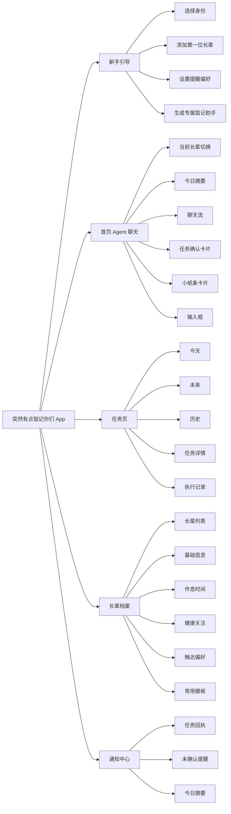

# 有点惦记PRD

```Markdown
# 突然有点惦记你们 PRD

> filename: `突然有点惦记你们_PRD.md`

---

## 0. 项目摘要

### 0.1 项目名称

**突然有点惦记你们**

### 0.2 项目一句话

「突然有点惦记你们」是一个面向家属与老人的 AI 亲情回执 Agent。家属只需一句话，就能为长辈创建提醒任务，由 AI 通过电话或消息温柔触达，并追踪长辈是否收到、是否确认、是否完成，让远方的惦记不再停在“我发了”，而是变成“TA 回了，我放心了”。

### 0.3 Hackathon 展示版 Slogan

> 不是提醒老人，而是让惦记有回声。

### 0.4 产品关键词

- 远程照护
- 老人提醒
- 电话触达
- 语音回执
- 亲情表达
- 小纸条
- AI Agent
- 温柔沟通
- 状态确认

---

## 1. 项目定位

### 1.1 产品定位

面向「家属 - 老人/长辈」远程照护场景的双端 AI Agent 产品。

产品解决的核心问题不是单纯“提醒”，而是：

- 家属想提醒，但没空反复说；
- 家属发了消息，但老人不一定看到；
- 老人看到了，家属不一定知道；
- 家属想表达关心，但出口容易变成催促、责备或唠叨；
- 远方照护缺少一个温暖、明确、可追踪的“回应”。

### 1.2 产品核心价值

将家属对长辈的惦记从：

- “我发了，但不知道 TA 有没有看到”
- “我提醒了，但不知道 TA 有没有做”
- “我想关心，但说出口像责备”
- “我太忙了，没法每天重复提醒”

变成：

- 一句话创建任务
- AI 自动温柔提醒
- 长辈通过电话、语音或按钮简单回应
- 家属实时看到状态回执
- 生硬的话被改写成更像家人的表达

### 1.3 MVP 聚焦

MVP 只做三件事：

1. **一句话创建提醒任务**  
   家属输入自然语言，AI 解析为可执行、可确认、可追踪的任务。

2. **电话/消息触达与回执**  
   AI 到点通过电话或消息提醒长辈，并回收“已收到 / 已完成 / 未响应”等状态。

3. **小纸条表达改写**  
   AI 将家属生硬、焦虑、命令式的话，改写成更温柔、简洁、适合长辈接收的表达，并可直接发送。

---

## 2. 目标用户

### 2.1 主要用户：家属 / 照护者

| 维度 | 描述 |
|---|---|
| 年龄 | 25-55 岁 |
| 身份 | 子女、孙辈、配偶、亲属，或承担日常关心责任的人 |
| 状态 | 异地、工作繁忙、无法持续陪伴长辈 |
| 核心需求 | 远程提醒、确认状态、表达关心、降低焦虑 |
| 情绪痛点 | “我不是不关心，是我真的顾不过来” |

#### 典型心理

- 想照顾，但没有足够时间。
- 想提醒，但不想显得啰嗦。
- 想确认，但又怕频繁打扰。
- 想表达爱，但常说成责备。
- 最想知道的是：TA 收到了，TA 没事，我就放心了。

---

### 2.2 次要用户：老人 / 长辈

| 维度 | 描述 |
|---|---|
| 年龄 | 60+ |
| 身份 | 父母、祖父母、外祖父母、年长亲属等 |
| 设备 | 手机 App 为主，未来可接入手表、老人机、音箱等 |
| 使用特点 | 不习惯复杂 App 操作，更容易接受电话、语音、大按钮 |
| 沟通偏好 | 简单、温和、直接，不喜欢命令式或责备式表达 |

#### 典型特点

- 对微信文字、App 消息不敏感。
- 更习惯电话和语音。
- 不一定会主动点击复杂确认。
- 更容易接受“像家人说话”的提醒。

---

## 3. 核心场景

| 场景 | 家属输入 | AI 行为 | 家属得到的结果 |
|---|---|---|---|
| 吃药提醒 | 今晚 8 点提醒爸爸吃降压药 | 创建任务，到点电话提醒 | 爸爸已接听 / 已确认 / 未响应 |
| 测量提醒 | 明早饭后提醒奶奶测血糖，测完告诉我 | 电话提醒并要求回传结果 | 奶奶回复血糖值或状态未确认 |
| 出门带物 | 明天去医院前提醒外公带医保卡、病历和水杯 | 解析物品清单并提醒 | 外公已确认知道 |
| 回电确认 | 下午提醒妈妈给我回个电话 | 创建回电任务 | 妈妈已收到提醒 |
| 关系沟通 | 把“你怎么又忘吃药”说得温柔点 | 生成 3 个小纸条版本 | 可直接发送给指定长辈 |
| 今日跟进 | 今天爷爷的任务完成了吗？ | 汇总任务状态 | 今日 3 项，2 项完成，1 项待确认 |

---

## 4. 产品目标

### 4.1 用户目标

- 家属可以用一句话创建提醒任务。
- 家属可以查看长辈是否收到、确认、完成。
- 长辈可以通过电话、语音或大按钮完成简单反馈。
- 家属可以把不好说的话改写成更温柔的小纸条。
- 支持添加多位长辈，并为每位长辈维护独立画像和任务。

### 4.2 产品目标

- 提高提醒触达率。
- 提高老人确认率。
- 降低家属重复沟通成本。
- 降低家属因“联系不上 / 没回应”产生的焦虑。
- 让亲情表达更自然、更不刺耳。

### 4.3 Hackathon 展示目标

在 3-5 分钟 Demo 中清晰展示：

1. 家属输入一句惦记。
2. AI 解析为任务。
3. AI 生成温柔提醒话术。
4. AI 模拟电话触达长辈。
5. 长辈语音 / 按钮回应。
6. 家属端收到明确回执。
7. 同一句生硬表达可改写成小纸条。

---

## 5. 非目标

MVP 阶段不做：

- 医疗诊断。
- 用药建议。
- 紧急救援服务。
- 医疗责任判断。
- 复杂家庭组织管理。
- 多家属权限协作。
- 深度手表硬件接入。
- 情绪识别和心理咨询。
- 开放式超级 Agent。

产品只聚焦：

> 提醒、触达、确认、表达。

---

## 6. 产品形态

### 6.1 家属端

家属端负责：

- 添加 / 切换长辈。
- 一句话创建提醒任务。
- 查看任务状态。
- 接收提醒回执。
- 生成小纸条。
- 发送小纸条。
- 管理长辈画像。

### 6.2 长辈端

长辈端负责：

- 接收电话提醒。
- 接收 App 内消息。
- 查看简洁提醒内容。
- 通过按钮确认“知道了”。
- 通过按钮确认“完成了”。
- 通过语音回复结果。

### 6.3 Agent 能力层

AI Agent 需要具备以下能力：

1. 意图识别  
2. 任务结构化  
3. 时间解析  
4. 长辈对象识别  
5. 触达策略选择  
6. 温柔话术生成  
7. 小纸条改写  
8. 语音回执理解  
9. 状态跟踪  
10. 失败重试  
11. 今日摘要生成  

---

## 7. MVP 功能范围

### 7.1 P0 必做功能

| 模块 | 功能 | 说明 |
|---|---|---|
| 新手引导 | 添加第一位长辈 | 录入称呼、关系、联系方式、作息、关注事项 |
| 长辈管理 | 新增 / 切换长辈 | 支持多位长辈基础档案 |
| Agent 聊天 | 自然语言输入 | 支持创建任务、改写小纸条、查询状态 |
| 任务解析 | 一句话创建任务 | 支持吃药、测量、带物、回电、其他 |
| 任务确认卡片 | 结构化确认 | 展示长辈、时间、内容、方式、确认要求 |
| 电话提醒 | 到点语音触达 | 优先通过电话 / App 内语音电话提醒 |
| 消息提醒 | 补充触达 | 电话失败后可发送 App 内消息 |
| 状态回执 | 任务状态更新 | 已创建、已触达、已确认、已完成、未确认、超时 |
| 小纸条 | 表达改写 | 生成 3 个版本，可继续调整和发送 |
| 今日摘要 | 状态汇总 | 按长辈展示今日完成和未确认事项 |

---

### 7.2 P1 可延后功能

| 功能 | 说明 |
|---|---|
| 多家属协作 | 多位家属共同照护同一位长辈 |
| 权限管理 | 管理不同家属可见范围 |
| 手表接入 | 接入智能手表提醒和确认 |
| 短信 / 微信接入 | 扩展触达渠道 |
| 复杂语音识别 | 识别更多长辈自然语言回复 |
| 自动推荐跟进 | 根据历史任务推荐今天要提醒什么 |
| 紧急联系人升级 | 多次未响应后通知紧急联系人 |
| 情绪个性化 | 更深度地拟合家庭说话风格 |

---

## 8. 信息架构




---


## 9\. 核心功能设计


---


# 9\.1 新手引导 / 添加长辈


## 目标


让系统快速认识第一位长辈，并生成默认提醒策略。


## 首次进入流程


```Plain Text
flowchart TD
A[用户首次进入] --> B[选择身份: 我是家属]
B --> C[添加一位我惦记的人]
C --> D[填写关系和称呼]
D --> E[填写联系方式]
E --> F[设置方便接收提醒时间]
F --> G[选择重点关注事项]
G --> H[选择沟通偏好]
H --> I[生成这位长辈的惦记助手]
I --> J[进入首页 Agent 聊天]
```


## 表单字段


|字段|类型|必填|示例|
|---|---|---|---|
|关系|单选|是|妈妈、爸爸、奶奶、爷爷、外婆、外公、其他|
|平时怎么称呼 TA|文本|是|妈、爸、奶奶、王叔|
|手机号|手机号|是|138xxxx|
|设备类型|单选|否|手机 App、老人机、手表|
|方便接电话时间|时间段|否|8:00\-21:00|
|重点关注事项|多选|否|吃药、测血糖、复诊、出门带物|
|沟通偏好|多选|否|温柔一点、简短一点、直接一点|
|响应习惯|文本 / 选择|否|上午容易接电话，晚上不怎么看手机|


## 默认规则


- 如果用户只添加一位长辈，该长辈默认为当前长辈。

- 如果添加多位长辈，首页顶部提供当前长辈切换器。

- 每个任务必须绑定一个长辈。

- 如果用户没有指定长辈，则默认绑定当前长辈。

- 如果当前长辈不明确，AI 需要追问：“你想提醒哪位长辈？”

    

---


# 9\.2 长辈管理


## 目标


支持家属添加和切换多位长辈，但不做复杂家庭协作。


## 功能


- 查看长辈列表。

- 新增长辈。

- 编辑长辈信息。

- 设置提醒偏好。

- 查看单个长辈今日跟进状态。

- 查看该长辈历史任务。

    

## 长辈卡片字段


- 称呼

- 关系

- 今日任务数量

- 已完成数量

- 待确认数量

- 异常数量

- 最近一次回应时间

    

## 示例


```Plain Text
┌──────────────────────┐
│ 我惦记的人             │
├──────────────────────┤
│ 妈妈                   │
│ 今日：2完成 / 1待确认    │
│ 最近回应：10分钟前        │
├──────────────────────┤
│ 爸爸                   │
│ 今日：1项待提醒          │
│ 最近回应：昨天 20:10      │
├──────────────────────┤
│ 奶奶                   │
│ 今日：暂无任务           │
│ 最近回应：3天前           │
├──────────────────────┤
│ + 添加一位长辈           │
└──────────────────────┘
```


---


# 9\.3 Agent 聊天页


## 目标


作为产品主入口，让家属通过自然语言完成所有核心操作。


## 支持意图


|意图|示例|系统动作|
|---|---|---|
|创建任务|明早 8 点提醒爸爸测血糖|解析并生成任务卡片|
|改写表达|把“你怎么又忘吃药”说得温柔点|生成小纸条|
|查询状态|今天奶奶确认了吗？|返回任务摘要|
|编辑任务|把提醒改到晚上 9 点|修改任务字段|
|取消任务|取消今晚吃药提醒|取消任务|
|新增长辈|我想加一下外公|进入新增长辈流程|


## 意图识别输出格式


```JSON
{
  "intent": "create_task",
  "confidence": 0.94,
  "target_elder": "爸爸",
  "need_follow_up": false,
  "missing_fields": []
}
```


---


# 9\.4 一句话创建任务


## 支持任务类型


MVP 支持 5 类：


1. 吃药

2. 健康测量

3. 出门带物

4. 回电 / 联系

5. 其他

    

## 用户输入示例


- 今晚 8 点提醒爸爸吃降压药。

- 明天去医院前提醒外公带医保卡、病历和水杯。

- 每天早饭后提醒奶奶测血糖，测完告诉我。

- 下午 4 点提醒妈妈给我回个电话。

- 明天上午提醒爷爷晒被子。

    

## Agent 解析字段


```JSON
{
  "task_title": "提醒爸爸吃降压药",
  "task_type": "medication",
  "elder_id": "elder_002",
  "elder_display_name": "爸爸",
  "remind_time": "2026-01-01 20:00",
  "repeat_rule": "none",
  "content": "今晚 8 点吃降压药",
  "channel": "phone",
  "need_confirmation": true,
  "confirmation_type": "voice_or_button",
  "need_result": false,
  "priority": "normal"
}
```


## 任务确认卡片展示字段


- 长辈

- 任务名称

- 提醒时间

- 提醒内容

- 触达方式

- 是否需要确认

- 是否需要结果回传

- 失败后是否二次提醒

- 操作按钮：

    - 确认创建

    - 编辑

    - 取消

        

## 任务创建规则


|情况|规则|
|---|---|
|时间明确|直接生成任务确认卡片|
|时间不完整|AI 追问一次|
|未指定长辈|默认当前长辈；如不明确则追问|
|未指定触达方式|默认电话|
|吃药任务|默认需要确认|
|测量任务|默认需要结果回传|
|带物任务|默认需要确认|
|回电任务|默认需要确认|
|其他任务|默认需要确认|
|时间已过|询问是否改为最近可用时间|


## 追问示例


用户：


> 明天提醒爷爷吃药。
> 
> 


AI：


> 好的，明天几点提醒爷爷比较合适？
> 
> 


---


# 9\.5 多长辈识别规则


## 目标


让 AI 能正确判断任务、小纸条和状态查询对应哪位长辈。


## 规则


### 1\. 用户明确指定长辈


用户输入：


> 明早 8 点提醒奶奶测血糖。
> 
> 


系统识别：


```JSON
{
  "elder_display_name": "奶奶",
  "task_type": "health_measurement",
  "remind_time": "明早 8 点"
}
```


### 2\. 用户未指定长辈


用户输入：


> 今晚提醒吃药。
> 
> 


处理规则：


- 如果当前页面已选中“妈妈”，默认绑定妈妈。

- 如果当前没有选中长辈，追问：“你想提醒哪位长辈？”

- 如果上下文中最近操作的是某位长辈，可优先使用上下文，但需要在卡片中明确展示。

    

### 3\. 用户使用昵称


如果用户设置过昵称映射：


|昵称|映射对象|
|---|---|
|老妈|妈妈|
|我爸|爸爸|
|奶|奶奶|
|外婆|外婆|


AI 应自动映射到对应长辈。


### 4\. 多人同时出现


用户输入：


> 明天提醒爸妈都量血压。
> 
> 


MVP 处理方式：


- 生成两个独立任务：

    - 提醒爸爸量血压

    - 提醒妈妈量血压

- 确认卡片中展示两个任务。

- 用户可分别编辑或确认。

    

---


# 9\.6 电话 / 消息提醒


## 目标


通过更适合老人的方式触达提醒，并回收确认状态。


## 触达优先级


MVP 默认：


1. 电话 / App 内语音电话

2. App 内消息

3. 家属端未响应通知

    

未来扩展：


- 短信

- 微信

- 智能手表

- 语音音箱

- 老人机

    

## 电话提醒话术规则


电话提醒内容需要：


- 简短

- 温柔

- 明确

- 不命令

- 像家人托付

- 明确告诉长辈如何回应

    

## 话术示例


### 吃药


> 爸爸，晚上好。现在该吃降压药啦。吃完之后说一声“吃好了”，我这边就放心了。
> 
> 


### 测血糖


> 奶奶，现在可以测一下血糖啦。测完之后，您直接告诉我数值就行。
> 
> 


### 出门带物


> 外公，明天去医院前记得带医保卡、病历和水杯。您听到后说一声“知道了”就好。
> 
> 


## 失败重试规则


|情况|系统行为|
|---|---|
|第一次未接|10 分钟后再次拨打|
|第二次未接|发送 App 内消息|
|仍未响应|通知家属：TA 暂时还没回应|
|已确认收到|停止提醒|
|已确认完成|停止提醒并通知家属|
|长辈挂断|标记为未确认，并通知家属|
|长辈回复无法识别|标记为“已回复，待查看”|


---


# 9\.7 任务状态管理


## 状态枚举


|状态|含义|UI 颜色|
|---|---|---|
|created|已创建，等待执行|灰色|
|scheduled|已排程|灰色|
|sent|已发起提醒|蓝色|
|reached|已触达长辈|蓝色|
|confirmed|长辈已确认收到|绿色|
|completed|长辈确认已完成 / 回传结果|绿色|
|unconfirmed|长辈未确认|黄色|
|timeout|超时未响应|红色|
|cancelled|已取消|灰色|
|need\_review|有回复但无法识别，待家属查看|紫色|


## 状态说明


必须区分：


- **已触达 reached**：电话接通或消息送达。

- **已确认 confirmed**：长辈明确表示“知道了”。

- **已完成 completed**：长辈明确表示“做完了”或回传结果。

    

## 示例


### 吃药任务


|长辈回应|状态|
|---|---|
|知道了|confirmed|
|吃完了|completed|
|没回应|unconfirmed / timeout|


### 测血糖任务


|长辈回应|状态|
|---|---|
|知道了|confirmed|
|6\.1|completed|
|测完了，正常|completed|
|听不清 / 无法识别|need\_review|


---


# 9\.8 小纸条功能


## 目标


将家属生硬、焦虑、命令式的话，改写成更适合长辈接收的温柔表达。


## 输入示例


> 你怎么又忘吃药了？
> 
> 


## 输出示例


AI 生成 3 个版本：


### 版本 1：温柔型


> 爸，记得把药吃了呀。你吃完我就放心啦。
> 
> 


### 版本 2：轻松型


> 爸爸，今天的小药别忘啦，吃完跟我说一声，我就安心了。
> 
> 


### 版本 3：直接型


> 爸，今晚记得吃药，吃完告诉我一声。
> 
> 


## 风格选项


- 温柔一点

- 简短一点

- 直接一点

- 像我平时说话

- 不要太肉麻

- 更像纸条

- 转成电话语音稿

    

## 小纸条规则


AI 输出必须遵守：


- 不责备。

- 不吓唬。

- 不制造内疚。

- 不使用“你怎么又……”。

- 少用“必须”“一定”等命令词。

- 保留真实关心。

- 字数控制在 20\-60 字。

- 适合老人阅读或听电话语音。

    

## 小纸条输出格式


```JSON
{
  "target_elder": "爸爸",
  "original_text": "你怎么又忘吃药了？",
  "versions": [
    {
      "style": "温柔型",
      "text": "爸，记得把药吃了呀。你吃完我就放心啦。"
    },
    {
      "style": "轻松型",
      "text": "爸爸，今天的小药别忘啦，吃完跟我说一声，我就安心了。"
    },
    {
      "style": "直接型",
      "text": "爸，今晚记得吃药，吃完告诉我一声。"
    }
  ],
  "actions": ["send", "save", "rewrite", "convert_to_voice_script"]
}
```


---


# 9\.9 今日摘要


## 目标


让家属快速知道今天每位长辈的提醒和回应情况。


## 展示示例


> 今天惦记了 3 件事：  
> 
> 妈妈完成了 2 项，爸爸还有 1 项没回应。  
> 
> 未确认事项：爸爸今晚 8 点吃降压药。
> 
> 


## 摘要字段


- 今日任务总数

- 按长辈分组任务数

- 已完成数

- 已确认数

- 未确认数

- 超时任务数

- 最近回应

- 建议跟进事项

    

---


## 10\. 核心流程


---


# 10\.1 一句话创建任务流程


```Plain Text
flowchart TD
A[家属输入自然语言] --> B[AI 判断意图: 创建任务]
B --> C[解析长辈/时间/任务类型/确认方式]
C --> D{信息是否完整}
D -- 否 --> E[AI 追问缺失信息]
E --> C
D -- 是 --> F[生成任务确认卡片]
F --> G{用户操作}
G -- 确认 --> H[任务进入任务列表]
G -- 编辑 --> I[修改任务字段]
I --> F
G -- 取消 --> J[放弃创建]
H --> K[到点电话/消息提醒]
K --> L[长辈回应/未回应]
L --> M[更新任务状态]
M --> N[家属端收到回执]
```


---


# 10\.2 任务回执流程


```Plain Text
flowchart TD
A[到达提醒时间] --> B[电话提醒长辈]
B --> C{是否接听}
C -- 是 --> D[播放温柔提醒话术]
D --> E{长辈是否回应}
E -- 知道了 --> F[状态: confirmed]
E -- 做完了/回传结果 --> G[状态: completed]
E -- 无法识别 --> H[状态: need_review]
E -- 没回应 --> I[状态: unconfirmed]
C -- 否 --> J[10分钟后二次拨打]
J --> K{是否接听}
K -- 是 --> D
K -- 否 --> L[发送App消息]
L --> M[通知家属暂未回应]
```


---


# 10\.3 小纸条流程


```Plain Text
flowchart TD
A[家属输入原话] --> B[AI 判断意图: 改写表达]
B --> C[识别发送对象]
C --> D{是否有对象}
D -- 否 --> E[询问想发给哪位长辈]
E --> C
D -- 是 --> F[生成3个小纸条版本]
F --> G[用户选择版本]
G --> H{是否继续调整}
H -- 是 --> I[更温柔/更简短/更像我说话]
I --> F
H -- 否 --> J[发送给长辈或保存]
```


---


# 10\.4 新增长辈流程


```Plain Text
flowchart TD
A[点击添加一位长辈] --> B[选择关系]
B --> C[填写称呼]
C --> D[填写手机号/绑定设备]
D --> E[设置方便接收提醒时间]
E --> F[选择重点关注事项]
F --> G[选择沟通偏好]
G --> H[保存长辈档案]
H --> I[切换为当前长辈]
I --> J[返回首页]
```


---


## 11\. 数据模型


---


# 11\.1 长辈画像 ElderProfile


```JSON
{
  "id": "elder_001",
  "display_name": "妈妈",
  "real_name": "李女士",
  "relation": "mother",
  "relation_label": "妈妈",
  "nicknames": ["妈", "老妈"],
  "phone": "13800000000",
  "device_type": "mobile_app",
  "preferred_channels": ["phone", "app_message"],
  "available_time": {
    "start": "08:00",
    "end": "21:00"
  },
  "health_focus": ["medication", "blood_glucose", "hospital_visit"],
  "communication_preference": "warm_simple",
  "response_habit": "morning_phone_better",
  "created_at": "2026-01-01 10:00:00",
  "updated_at": "2026-01-01 10:00:00"
}
```


---


# 11\.2 家属画像 CaregiverProfile


```JSON
{
  "id": "user_001",
  "name": "小王",
  "role": "child",
  "default_elder_id": "elder_001",
  "writing_style": "natural_warm",
  "care_focus": ["medication", "hospital_visit"],
  "notification_preference": "important_only",
  "created_at": "2026-01-01 10:00:00"
}
```


---


# 11\.3 任务 Task


```JSON
{
  "id": "task_001",
  "title": "提醒爸爸吃降压药",
  "type": "medication",
  "elder_id": "elder_002",
  "elder_display_name": "爸爸",
  "content": "今晚 8 点吃降压药",
  "remind_time": "2026-01-01 20:00:00",
  "repeat_rule": "none",
  "channel": "phone",
  "priority": "normal",
  "need_confirmation": true,
  "confirmation_type": "voice_or_button",
  "need_result": false,
  "status": "created",
  "result": null,
  "created_by": "user_001",
  "created_at": "2026-01-01 10:00:00",
  "updated_at": "2026-01-01 10:00:00"
}
```


---


# 11\.4 执行记录 TaskExecutionLog


```JSON
[
  {
    "time": "20:00",
    "event_type": "call_started",
    "event": "发起电话提醒"
  },
  {
    "time": "20:01",
    "event_type": "call_connected",
    "event": "爸爸接听电话"
  },
  {
    "time": "20:02",
    "event_type": "voice_response",
    "event": "爸爸语音回复：知道了"
  },
  {
    "time": "20:02",
    "event_type": "status_updated",
    "event": "任务状态更新为 confirmed"
  },
  {
    "time": "20:03",
    "event_type": "caregiver_notified",
    "event": "已通知家属"
  }
]
```


---


# 11\.5 小纸条 Note


```JSON
{
  "id": "note_001",
  "elder_id": "elder_002",
  "elder_display_name": "爸爸",
  "original_text": "你怎么又忘吃药了？",
  "selected_style": "warm",
  "final_text": "爸，记得把药吃了呀。你吃完我就放心啦。",
  "status": "sent",
  "created_at": "2026-01-01 19:30:00",
  "sent_at": "2026-01-01 19:31:00"
}
```


---


## 12\. UI 页面结构


---


# 12\.1 页面一：新手引导页


## 页面目标


快速添加第一位长辈，建立最小可用画像。


## 页面结构


```Plain Text
┌──────────────────────────────┐
│ 突然有点惦记你们                │
│ 副标题：先添加一位你惦记的人      │
├──────────────────────────────┤
│ TA 是你的？                     │
│ [妈妈] [爸爸] [奶奶] [爷爷]      │
│ [外婆] [外公] [其他]             │
│                                │
│ 你平时怎么称呼 TA？              │
│ [ 妈 / 爸 / 奶奶 / 王叔     ]    │
│                                │
│ TA 的手机号？                    │
│ [ 138xxxxxxx              ]     │
│                                │
│ 平时什么时候方便接电话？          │
│ [上午] [下午] [晚上] [自定义]     │
│                                │
│ 你最常惦记哪些事？               │
│ [吃药] [测血糖] [复诊] [带物]    │
│                                │
│ TA 喜欢怎样被提醒？              │
│ [温柔一点] [简短一点] [直接一点]  │
├──────────────────────────────┤
│ CTA：生成这位长辈的惦记助手       │
└──────────────────────────────┘
```


---


# 12\.2 页面二：首页 / Agent 聊天页


## 页面目标


作为主入口，支持任务创建、小纸条生成、状态查询。


## 页面结构


```Plain Text
┌────────────────────────────────┐
│ 顶部栏                          │
│ 突然有点惦记你们      当前：妈妈 ▼ │
│                         [+ 添加] │
├────────────────────────────────┤
│ 今日摘要卡片                    │
│ 今天惦记了 3 件事：2 件已完成，1 件待确认 │
├────────────────────────────────┤
│ 聊天流                          │
│                                │
│ 用户：明早 8 点提醒爸爸测血糖      │
│                                │
│ AI：我帮你整理好了。              │
│ ┌────────────────────────────┐ │
│ │ 任务卡片                    │ │
│ │ 长辈：爸爸                  │ │
│ │ 事项：测血糖                 │ │
│ │ 时间：明早 8:00             │ │
│ │ 方式：电话提醒               │ │
│ │ 回执：需要结果               │ │
│ │ [确认创建] [编辑] [取消]      │ │
│ └────────────────────────────┘ │
│                                │
│ 用户：把“你怎么又忘吃药”说温柔点  │
│                                │
│ AI：可以，这样说会更舒服一点。     │
│ ┌────────────────────────────┐ │
│ │ 小纸条                      │ │
│ │ 爸，记得把药吃了呀。          │ │
│ │ 你吃完我就放心啦。            │ │
│ │ [发送给爸爸] [再温柔点]       │ │
│ └────────────────────────────┘ │
├────────────────────────────────┤
│ 输入区                          │
│ [交代任务] [写小纸条] [查状态]    │
│ 输入框：突然想起什么，就告诉我... │
│                         [发送] │
└────────────────────────────────┘
```


---


# 12\.3 页面三：长辈切换 / 左侧抽屉


## 页面目标


让家属快速切换当前长辈，查看每位长辈今日状态。


## 页面结构


```Plain Text
┌────────────────────────┐
│ 我惦记的人               │
├────────────────────────┤
│ ● 妈妈                   │
│ 今日：2完成 / 1待确认      │
│ 最近回应：10分钟前          │
├────────────────────────┤
│ ○ 爸爸                   │
│ 今日：1项待提醒            │
│ 最近回应：昨天 20:10        │
├────────────────────────┤
│ ○ 奶奶                   │
│ 今日：暂无任务             │
│ 最近回应：3天前             │
├────────────────────────┤
│ + 添加一位长辈             │
└────────────────────────┘
```


---

# 12\.4 页面四：任务页


## 页面目标


查看所有提醒任务的状态、时间、对象和执行记录，帮助家属快速判断哪些事已经放心，哪些事还需要跟进。


## 页面结构


```Plain Text
┌──────────────────────────────┐
│ 任务                           │
│ [今天] [未来] [历史]            │
├──────────────────────────────┤
│ 筛选：全部 吃药 测量 带物 回电 未确认 │
├──────────────────────────────┤
│ 🟢 妈妈｜吃降压药                │
│ 今天 08:00｜电话｜已完成          │
│                                │
│ 🟡 爸爸｜测血糖                  │
│ 今天 20:00｜电话｜待确认          │
│                                │
│ 🔴 外公｜带医保卡                │
│ 今天 09:00｜电话｜超时未回应      │
│                                │
│ 🔵 奶奶｜复诊提醒                │
│ 明天 07:30｜电话｜待提醒          │
└──────────────────────────────┘
```


## 任务卡片字段


|字段|说明|
|---|---|
|长辈称呼|妈妈、爸爸、奶奶等|
|任务标题|吃药、测血糖、带物、复诊等|
|提醒时间|今天 20:00、明早 08:00|
|触达方式|电话、App 消息|
|状态灯|已完成、待确认、超时、待提醒|
|最近执行记录|如“20:01 已接听”|


## 状态颜色


|状态|颜色|文案|
|---|---|---|
|已完成|绿色|已完成|
|已确认|绿色|已确认|
|已触达|蓝色|已触达|
|待提醒|灰色|待提醒|
|待确认|黄色|待确认|
|超时未回应|红色|暂时没回应|
|待查看|紫色|有回复待查看|


---


# 12\.5 页面五：任务详情页


## 页面目标


展示单个任务的完整执行链路，明确区分“提醒了”“收到了”“完成了”。


## 页面结构


```Plain Text
┌──────────────────────────────┐
│ 提醒爸爸测血糖                  │
│ 状态：已完成 🟢                 │
├──────────────────────────────┤
│ 长辈：爸爸                      │
│ 时间：今天 08:00                │
│ 方式：电话提醒                  │
│ 回执要求：需要结果               │
│ 爸爸回复：血糖 6.1              │
├──────────────────────────────┤
│ 执行记录                        │
│ 08:00 发起电话提醒              │
│ 08:01 爸爸接听                  │
│ 08:02 爸爸回复：血糖 6.1        │
│ 08:02 状态更新为已完成           │
│ 08:03 已通知家属                │
├──────────────────────────────┤
│ [再次提醒] [编辑任务] [取消任务] │
└──────────────────────────────┘
```


## 关键规则


- 如果任务已完成，优先展示长辈回复内容。

- 如果任务未确认，展示最近一次触达记录。

- 如果任务超时，展示系统已尝试的触达动作。

- 家属可手动标记：

    - 已确认

    - 已完成

    - 稍后再提醒

    - 不再提醒

        

---


# 12\.6 页面六：长辈档案页


## 页面目标


管理每位长辈的基础信息、触达偏好、沟通偏好和常用提醒模板。


## 页面结构


```Plain Text
┌──────────────────────────────┐
│ 妈妈                           │
│ 最近回应：10分钟前              │
├──────────────────────────────┤
│ 今日跟进                        │
│ 已完成 2 项，待确认 1 项         │
├──────────────────────────────┤
│ 基础信息                        │
│ 关系：妈妈                      │
│ 称呼：妈                        │
│ 电话：138xxxxxxx                │
│ 设备：手机 App                  │
├──────────────────────────────┤
│ 提醒偏好                        │
│ 优先方式：电话                  │
│ 方便时间：08:00-21:00           │
│ 失败重试：10分钟后二次提醒       │
├──────────────────────────────┤
│ 沟通偏好                        │
│ 温柔一点、简短一点、不命令       │
├──────────────────────────────┤
│ 健康关注                        │
│ 吃药、测血糖、复诊               │
├──────────────────────────────┤
│ 常用模板                        │
│ [吃药提醒] [测血糖] [复诊带物]   │
├──────────────────────────────┤
│ [编辑档案] [添加提醒]            │
└──────────────────────────────┘
```


## 长辈档案编辑字段


|字段|说明|
|---|---|
|关系|妈妈、爸爸、奶奶、爷爷、外婆、外公、其他|
|显示称呼|在界面和话术中使用的称呼|
|昵称|用于 AI 识别用户自然语言中的称呼|
|电话|电话提醒使用|
|设备类型|手机 App、老人机、手表等|
|方便接电话时间|用于避免不合适时间打扰|
|触达优先级|电话优先、消息优先等|
|沟通偏好|温柔、简短、直接、不肉麻|
|健康关注|吃药、测量、复诊、饮食、出行|


---


# 12\.7 页面七：通知中心


## 页面目标


集中展示任务回执、未回应提醒、今日摘要和重要状态变化。


## 页面结构


```Plain Text
┌──────────────────────────────┐
│ 通知                           │
├──────────────────────────────┤
│ 🟢 爸爸已完成测血糖              │
│ 回复：血糖 6.1                  │
│ 2分钟前                         │
├──────────────────────────────┤
│ 🟡 妈妈暂时还没确认吃药提醒       │
│ 已电话提醒 2 次                  │
│ 10分钟前                        │
├──────────────────────────────┤
│ 🔴 外公未接听复诊带物提醒         │
│ 建议你亲自联系一下               │
│ 30分钟前                        │
├──────────────────────────────┤
│ 今日摘要                        │
│ 今天惦记了 5 件事，已完成 3 件    │
└──────────────────────────────┘
```


## 通知类型


|类型|示例|
|---|---|
|已完成通知|爸爸已完成测血糖|
|已确认通知|奶奶已确认收到吃药提醒|
|未回应通知|妈妈暂时还没回应|
|超时通知|外公连续两次未接听|
|今日摘要|今天惦记了 5 件事，3 件完成|
|需要查看|爷爷有一条语音回复待查看|


---


# 12\.8 页面八：长辈端提醒页


## 页面目标


让长辈用最少操作接收提醒、确认收到、反馈完成情况。


## 设计原则


- 字号大。

- 按钮大。

- 操作不超过 3 个。

- 不展示复杂任务字段。

- 尽量支持语音播报。

- 文案像家人说话，不像系统通知。

    

## 页面结构


```Plain Text
┌──────────────────────────────┐
│ 大标题：爸，该测血糖啦            │
├──────────────────────────────┤
│ 语音播报：                      │
│ “爸，现在可以测一下血糖啦。       │
│ 测完直接告诉我数值就行。”        │
├──────────────────────────────┤
│ 大按钮：我知道了                 │
│ 大按钮：我完成了                 │
│ 大按钮：语音告诉孩子结果          │
└──────────────────────────────┘
```


## 长辈端按钮规则


|按钮|状态变化|
|---|---|
|我知道了|confirmed|
|我完成了|completed|
|语音告诉孩子结果|录音并尝试识别，成功则 completed，失败则 need\_review|


---


## 13\. 视觉风格


### 13\.1 设计关键词


- 温暖

- 真实

- 像家人

- 不商业

- 不医疗化

- 不冷冰冰

- 有纸条感

- 有电话回声感

- 轻量但可靠

    

### 13\.2 整体氛围


「突然有点惦记你们」的视觉不应像医疗 App，也不应像效率工具。


它应该像：


- 一张留在桌上的纸条。

- 一通轻轻打过去的电话。

- 一句“你回我一下，我就放心了”。

- 一个帮你把惦记接住的小助手。

    

### 13\.3 色彩规范


|用途|颜色|说明|
|---|---|---|
|主色|`#F2996E`|暖橙色，表达亲情和温度|
|背景色|`#FFF7EF`|米白背景，柔和不刺眼|
|卡片色|`#FFFFFF`|保持清爽|
|纸条色|`#FFF1C7`|小纸条卡片背景|
|主文字|`#2F2924`|温和深棕，避免纯黑压迫|
|次级文字|`#8A7A6A`|柔和说明文字|
|成功色|`#4CAF7D`|已完成 / 已确认|
|待确认色|`#F2C94C`|待确认|
|异常色|`#E76F51`|超时 / 未回应|
|执行中色|`#6BA6FF`|已触达 / 正在执行|
|待查看色|`#9B7EDE`|有回复但待查看|


### 13\.4 字体规范


|场景|字号|
|---|---|
|页面标题|20\-24px|
|卡片标题|17\-18px|
|正文|15\-16px|
|辅助说明|13\-14px|
|长辈端标题|24\-28px|
|长辈端正文|20px 以上|
|长辈端按钮|22px 以上|


推荐字体：


- iOS：苹方

- Android：HarmonyOS Sans / 思源黑体

- Web：系统默认无衬线字体

    

### 13\.5 组件风格


#### 卡片


- 圆角：16px

- 内边距：16px

- 背景：白色或浅米色

- 阴影：轻阴影

- 任务卡片左侧可加状态色条

    

#### 小纸条卡片


- 背景：浅黄色 / 米白色

- 圆角：12px

- 可加入轻微纸纹

- 文案左对齐

- 可使用手写风小图标，但不要过度装饰

- 按钮使用轻量文字按钮

    

#### 按钮


|类型|样式|
|---|---|
|主按钮|暖橙背景，白色文字|
|次按钮|浅橙背景，深棕文字|
|文字按钮|深棕或主色文字|
|危险按钮|不突出，使用低饱和红色文字|


#### 状态灯


|状态|图标|
|---|---|
|已完成|🟢|
|待确认|🟡|
|超时 / 异常|🔴|
|已触达 / 执行中|🔵|
|待提醒|⚪|
|待查看|🟣|


---


## 14\. 文案风格


### 14\.1 总体原则


产品文案要像家人说话，而不是像系统通知。


要求：


- 温柔。

- 简短。

- 具体。

- 不责备。

- 不制造焦虑。

- 不过度煽情。

- 不使用冰冷的系统语言。

    

### 14\.2 推荐表达


|不推荐|推荐|
|---|---|
|老人未响应|TA 暂时还没回应|
|任务失败|这次还没确认上|
|请立即处理|你可以稍后亲自联系一下|
|必须填写手机号|先填手机号，才能帮你打电话提醒|
|执行异常|提醒没有顺利完成|
|用户确认|TA 说知道了|
|任务完成|TA 说已经做完了|


### 14\.3 AI 对家属说话风格


示例：


```Plain Text
我帮你整理好了，确认一下就可以。
```


```Plain Text
这句话有点着急，我帮你换成更温和的说法。
```


```Plain Text
爸爸暂时还没回应。我已经提醒了两次，你可以晚点亲自打个电话。
```


```Plain Text
奶奶回复了：血糖 6.1。你可以放心一点了。
```


### 14\.4 AI 对长辈说话风格


示例：


```Plain Text
爸，现在该吃药啦。吃完说一声，我这边就放心了。
```


```Plain Text
奶奶，明天去医院前，记得带医保卡、病历和水杯。
```


```Plain Text
妈，孩子有点惦记你。你听到后点一下“知道了”就行。
```


---


## 15\. 关键交互规则


### 15\.1 Agent 追问规则


AI 最多连续追问 2 次，避免用户疲劳。


优先补齐：


1. 长辈对象

2. 提醒时间

3. 提醒内容

4. 是否需要确认

5. 是否需要结果回传

    

### 15\.2 默认规则


|场景|默认值|
|---|---|
|未指定长辈|当前选中的长辈|
|无当前长辈|追问要提醒谁|
|未指定触达方式|电话|
|未指定确认方式|需要确认|
|吃药任务|默认需要确认|
|测量任务|默认需要结果回传|
|带物任务|默认需要确认|
|回电任务|默认需要确认|
|未指定优先级|普通|
|电话未接|10 分钟后二次提醒|


### 15\.3 模糊输入处理


|用户输入|AI 处理|
|---|---|
|明天提醒爸爸吃药|追问“明天几点提醒？”|
|晚点提醒妈妈|追问“你希望几点提醒？”|
|提醒奶奶别忘了|追问“具体要提醒奶奶什么？”|
|爸爸那个任务改一下|根据上下文定位任务；不明确则展示候选任务|
|取消今晚那个提醒|如果有多个任务，展示候选让用户选择|


### 15\.4 多任务处理


用户输入：


```Plain Text
明天提醒爸妈都量血压。
```


AI 处理：


- 识别为两个任务。

- 分别绑定爸爸、妈妈。

- 生成合并确认卡片。

- 用户可一键确认全部，也可单独编辑。

    

### 15\.5 状态变更通知规则


|状态变化|是否通知家属|
|---|---|
|created|不强通知|
|sent|不强通知|
|reached|可弱通知|
|confirmed|通知|
|completed|强通知|
|timeout|强通知|
|need\_review|强通知|


---


## 16\. AI Agent 能力要求


### 16\.1 意图分类


AI 需要将输入分为以下意图：


```JSON
[
  "create_task",
  "rewrite_note",
  "query_status",
  "edit_task",
  "cancel_task",
  "add_elder",
  "switch_elder",
  "unknown"
]
```


### 16\.2 任务解析 Schema


```JSON
{
  "intent": "create_task",
  "elder": {
    "display_name": "爸爸",
    "elder_id": "elder_002",
    "confidence": 0.95
  },
  "task": {
    "title": "提醒爸爸测血糖",
    "type": "health_measurement",
    "content": "测血糖，测完告诉我结果",
    "remind_time": "2026-01-01 08:00:00",
    "repeat_rule": "none",
    "channel": "phone",
    "need_confirmation": true,
    "need_result": true,
    "priority": "normal"
  },
  "missing_fields": [],
  "need_follow_up": false
}
```


### 16\.3 小纸条生成 Schema


```JSON
{
  "intent": "rewrite_note",
  "target_elder": {
    "display_name": "妈妈",
    "elder_id": "elder_001"
  },
  "original_text": "你怎么又不看消息？",
  "style": ["warm", "short", "family_like"],
  "outputs": [
    {
      "label": "温柔型",
      "text": "妈，我有点惦记你。看到的话回我一下，我就放心啦。"
    },
    {
      "label": "简短型",
      "text": "妈，看到消息回我一下呀，我有点放心不下。"
    },
    {
      "label": "自然型",
      "text": "妈，看到给我回个声，我就安心了。"
    }
  ]
}
```


### 16\.4 回执识别规则


AI 需要从长辈语音或文字中识别状态。


|长辈回复|识别结果|
|---|---|
|知道了|confirmed|
|好的|confirmed|
|看到了|confirmed|
|吃过了|completed|
|测了，6\.1|completed，result=6\.1|
|我等会儿|confirmed，但未完成|
|不用了|unconfirmed / cancelled\_by\_elder|
|听不清|need\_review|


### 16\.5 AI 禁止行为


AI 不得：


- 提供医疗诊断。

- 推荐药物剂量。

- 判断病情严重程度。

- 使用恐吓式表达。

- 责备老人。

- 责备家属。

- 编造长辈已经完成任务。

- 将“已触达”误写成“已完成”。

    

---


## 17\. Demo 设计：Hackathon 展示流程


### 17\.1 Demo 主线


主题：


> 远方照护最让人悬着的，不是“有没有提醒”，而是“有没有回应”。
> 
> 


### 17\.2 Demo 剧本


#### Step 1：家属输入一句话


```Plain Text
明早 8 点提醒奶奶测血糖，测完告诉我。
```


#### Step 2：AI 生成任务卡片


```Plain Text
我帮你整理好了：

长辈：奶奶
事项：测血糖
时间：明早 8:00
方式：电话提醒
回执：需要血糖结果

[确认创建] [编辑] [取消]
```


#### Step 3：模拟到点电话提醒


AI 电话话术：


```Plain Text
奶奶，现在可以测一下血糖啦。
测完之后，您直接告诉我数值就行。
```


#### Step 4：长辈语音回复


```Plain Text
测好了，6.1。
```


#### Step 5：家属端收到回执


```Plain Text
奶奶已完成测血糖。
回复：血糖 6.1。
你可以放心一点了。
```


#### Step 6：展示小纸条


用户输入：


```Plain Text
把“你怎么又忘吃药”说得温柔点。
```


AI 输出：


```Plain Text
爸，记得把药吃了呀。你吃完我就放心啦。
```


### 17\.3 Demo 亮点


- 自然语言创建任务。

- AI 自动结构化任务。

- 电话触达比消息更适合老人。

- 语音回执让家属放心。

- 小纸条让提醒不再像责备。

- 多长辈支持，产品不局限于妈妈。

    

---


## 18\. 成功指标


### 18\.1 核心业务指标


|指标|定义|
|---|---|
|任务创建成功率|用户自然语言输入后成功生成任务卡片的比例|
|任务确认率|用户点击确认创建任务的比例|
|提醒触达率|电话接通或消息送达的比例|
|长辈确认率|长辈点击或语音确认的比例|
|任务完成率|任务被标记为 completed 的比例|
|未响应下降率|重试机制后未响应任务减少比例|
|小纸条使用率|使用表达改写功能的用户比例|
|次日留存|用户第二天继续使用比例|
|7 日留存|用户 7 日后仍使用比例|


### 18\.2 情绪价值指标


通过问卷或轻量弹窗收集：


|问题|目标|
|---|---|
|是否减少你反复提醒长辈的压力？|衡量照护负担下降|
|是否让你更容易表达关心？|衡量小纸条价值|
|是否让你更安心知道 TA 有没有收到？|衡量回执价值|
|你是否愿意继续用它提醒家人？|衡量长期价值|


---


## 19\. 风险与应对


|风险|说明|应对|
|---|---|---|
|长辈不会确认|长辈可能只听电话，不点按钮|支持语音确认；状态区分“已触达”和“已确认”|
|电话未接通|长辈可能不接电话|10 分钟后二次提醒，再发消息，再通知家属|
|状态不等于真实完成|“提醒了”不代表“做了”|明确区分 reached、confirmed、completed|
|语音识别不准确|老人语音可能口音重、环境嘈杂|无法识别时标记 need\_review，让家属查看|
|AI 文案机械|小纸条可能不像家人|提供多版本和“更像我说话”二次改写|
|医疗风险|用户可能把产品当医疗建议|明确只做提醒，不做诊断和用药建议|
|多长辈混淆|任务可能绑定错对象|任务卡片必须展示长辈并二次确认|
|过度打扰长辈|高频提醒可能引起反感|设置可接收时间和提醒频率上限|


---


## 20\. 隐私与安全


### 20\.1 数据范围


产品会涉及：


- 家属手机号 / 账号信息

- 长辈姓名或称呼

- 长辈手机号

- 提醒任务内容

- 语音回复

- 健康相关提醒信息

    

### 20\.2 隐私原则


- 明确告知用户会使用电话或消息提醒长辈。

- 长辈联系方式仅用于提醒和回执。

- 健康信息仅用于任务提醒，不用于诊断。

- 语音回复仅用于状态识别和回执展示。

- 用户可删除长辈档案、任务记录和语音记录。

    

### 20\.3 权限要求


|权限|用途|
|---|---|
|通知权限|给家属发送任务回执|
|麦克风权限|长辈语音回复|
|电话 / 通话能力|发起提醒电话或 App 内语音电话|
|联系方式权限|可选，用于快速添加长辈|


---


## 21\. 验收标准


### 21\.1 新手引导


给定用户首次进入产品：


- 必须能添加第一位长辈。

- 必须能填写关系、称呼、手机号。

- 必须能选择关注事项。

- 完成后进入首页。

- 当前长辈默认为刚添加的长辈。

    

### 21\.2 一句话创建任务


给定输入：


```Plain Text
明早 8 点提醒爸爸测血糖，测完告诉我。
```


系统必须输出任务卡片：


|字段|结果|
|---|---|
|长辈|爸爸|
|类型|健康测量|
|时间|明早 8:00|
|内容|测血糖|
|方式|电话|
|需要确认|是|
|需要结果|是|


### 21\.3 多长辈识别


给定已添加：


- 妈妈

- 爸爸

- 奶奶

    

输入：


```Plain Text
今晚提醒奶奶吃药。
```


系统必须将任务绑定到“奶奶”，不得默认绑定当前长辈。


### 21\.4 未指定长辈


给定用户输入：


```Plain Text
今晚 8 点提醒吃药。
```


系统处理：


- 如果当前选中长辈为妈妈，则绑定妈妈，并在卡片展示“长辈：妈妈”。

- 如果没有当前长辈，则追问：“你想提醒哪位长辈？”

    

### 21\.5 电话提醒


到提醒时间后：


- 系统发起电话或 App 内语音电话。

- 如果长辈接听并确认，状态更新为 confirmed。

- 如果长辈回传结果，状态更新为 completed。

- 如果第一次未接，10 分钟后二次提醒。

- 如果第二次仍未接，发送消息并通知家属。

    

### 21\.6 小纸条


给定输入：


```Plain Text
你怎么又忘吃药了？
```


系统必须生成至少 3 个不责备的版本。


示例：


```Plain Text
爸，记得把药吃了呀。你吃完我就放心啦。
```


```Plain Text
爸爸，今天的小药别忘啦，吃完跟我说一声。
```


```Plain Text
爸，今晚记得吃药，吃完告诉我一声。
```


不得输出：


```Plain Text
你怎么又不听话。
```


```Plain Text
你必须马上吃药。
```


### 21\.7 状态区分


系统必须区分：


- 已创建

- 已触达

- 已确认

- 已完成

- 未确认

- 超时

- 有回复待查看

    

不得只用“成功 / 失败”表达任务结果。


---


## 22\. PRD 给 AI 生成原型时的提示词


如果要将本 PRD 喂给 AI 生成 UI 原型，可使用以下提示词。


### 22\.1 UI 生成提示词


```Plain Text
请基于《突然有点惦记你们 PRD》生成一套移动端 App 高保真 UI。

产品是面向家属远程照顾老人/长辈的 AI 亲情回执 Agent。
核心功能包括：
1. 添加长辈；
2. 一句话创建提醒任务；
3. 电话/消息提醒长辈；
4. 长辈确认或语音回执；
5. 家属查看任务状态；
6. 小纸条温柔改写。

视觉风格要求：
- 温暖、真实、亲情感；
- 不医疗化、不商业化；
- 米白背景、暖橙主色；
- 卡片圆角 16px；
- 小纸条使用浅黄色纸条风；
- 长辈端字号大、按钮大、操作极简。

请生成以下页面：
1. 新手引导 / 添加长辈页；
2. 首页 Agent 聊天页；
3. 长辈切换抽屉；
4. 任务列表页；
5. 任务详情页；
6. 长辈档案页；
7. 通知中心；
8. 长辈端提醒页。
```


### 22\.2 代码生成提示词


```Plain Text
请基于《突然有点惦记你们 PRD》生成一个可运行的前端 Demo。

技术栈：
- React / Next.js
- Tailwind CSS
- 移动端优先
- 使用 mock 数据
- 不需要真实电话能力，用模拟电话流程代替

必须实现：
1. 添加长辈；
2. 长辈切换；
3. Agent 聊天输入；
4. 输入一句话后生成任务确认卡片；
5. 点击确认创建任务；
6. 任务页展示状态；
7. 模拟“电话提醒长辈”；
8. 模拟长辈回复；
9. 状态更新为 confirmed 或 completed；
10. 小纸条生成 3 个版本；
11. 通知中心展示回执。

视觉风格：
- 主色 #F2996E；
- 背景 #FFF7EF；
- 卡片白色；
- 圆角 16px；
- 温暖亲情感；
- 不要企业 SaaS 风。
```


---


## 23\. 对外介绍文案


### 23\.1 一句话版


> 「突然有点惦记你们」让远方的提醒有回应，让不好说的关心变温柔。
> 
> 


### 23\.2 Hackathon 版


> 我们做的不是一个提醒工具，而是一个“亲情回执 Agent”。  
> 
> 它能把家属的一句惦记，变成一次温柔的电话提醒、一条更好听的小纸条，以及一个让人放心的回应。
> 
> 


### 23\.3 完整版


> 「突然有点惦记你们」是一个面向家属与老人的 AI 亲情回执 Agent。  
> 
> 家属只需一句话，就能为父母、爷爷奶奶或其他长辈创建提醒任务。AI 会在合适的时间通过电话或消息温柔提醒，并追踪长辈是否收到、是否确认、是否完成。  
> 
> 同时，它也能把那些容易说成责备的关心，改写成更像家人的小纸条。  
> 
> 我们希望让远方的照护不再停在“我发了”，而是变成“TA 回了，我放心了”。
> 
> 


---


## 24\. 项目边界总结


### 24\.1 我们做什么


- 帮家属创建提醒。

- 帮家属触达长辈。

- 帮家属确认是否收到。

- 帮家属看到是否完成。

- 帮家属把话说得更温柔。

    

### 24\.2 我们不做什么


- 不做医疗诊断。

- 不替代医生。

- 不承诺紧急救援。

- 不判断老人真实健康状况。

- 不做复杂家庭权限系统。

- 不把老人当成被管理对象。

    

### 24\.3 最核心的产品判断


这个产品的核心不是“提醒”，而是：


> 回应。
> 
> 


不是：


> 到点叫 TA 做事。
> 
> 


而是：


> 我惦记你，你给我一个回声，我就放心了。
> 
> 


---


## 25\. 最终定义


「突然有点惦记你们」是一个温柔的远程照护 Agent。


它把一句突然想起的惦记，变成：


1. 一个可执行的提醒；

2. 一通更容易被老人接收的电话；

3. 一句不伤人的家里话；

4. 一个明确的回执；

5. 一点点安心。

    

产品最终希望达成的体验是：


> 家属不用反复悬着，长辈不用被生硬催促。  
> 
> 关心被送到，也被回应。
> 
> 


